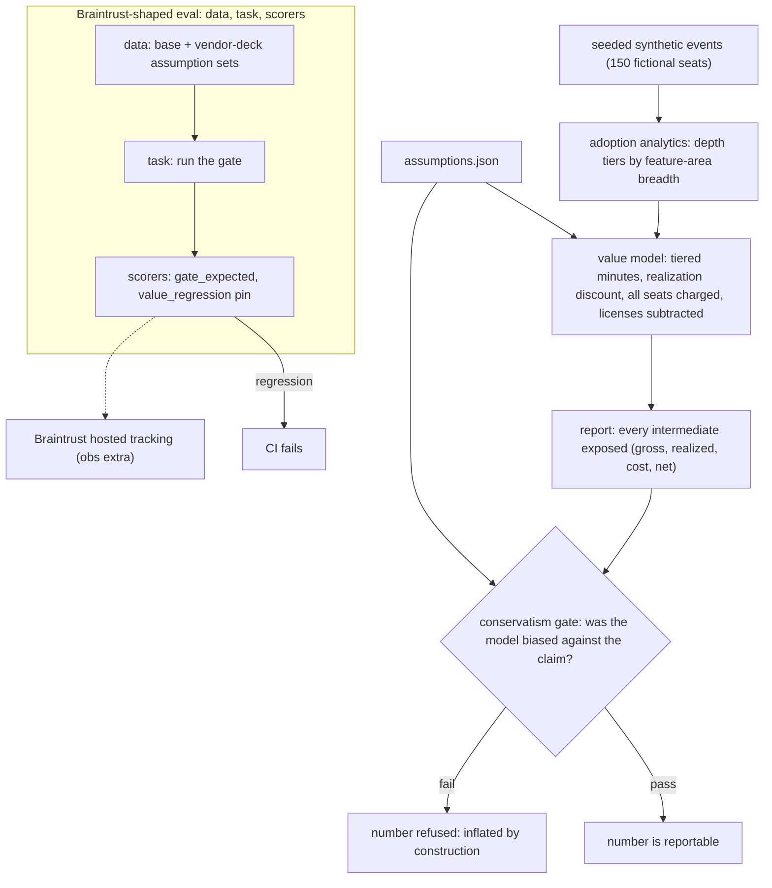

# roi-gate

[](https://github.com/jbisaccia-9/roi-gate/actions) · [captured results](RESULTS.md)

**An adoption/ROI model that refuses to report a number it can't defend.**

Every enterprise AI deployment produces a value claim. Most of them are
vendor-deck arithmetic: every seat counts as a beneficiary, every measured
minute converts to dollars, costs are someone else's slide. This repo encodes
the opposite discipline — a model deliberately biased **against** the claim —
and enforces it in CI: a configuration that inflates the number fails the
build.

On the same synthetic adoption data, the vendor-deck assumptions price this
deployment at **$517704/yr**. The gated model reports **$24,048/yr** — a
number one-tenth the size, and the only one of the two that survives a
skeptical CFO. The gate's job is to make the big number impossible to produce
quietly.

Sibling project: [kappa-gate](https://github.com/jbisaccia-9/kappa-gate) —
same thesis applied to LLM-as-judge evaluation (the judge must pass a
calibration gate before it is trusted).

## How it works

```
python -m roigate simulate    seeded synthetic event log — 150 fictional seats,
                              6 feature areas, mixed engagement (all values invented)
python -m roigate report      adoption depth tiers (heavy/medium/light/inactive by
                              feature-area breadth) -> tiered, discounted value model
python -m roigate gate        exit 0 only if the model was biased against the claim
```

## The conservatism gate

| check | why it exists |
|---|---|
| realization discount applied (≤ 0.6) | measured time saved ≠ value realized |
| every assigned seat charged | charging only active seats hides shelfware |
| license costs included | value net of nothing is not net value |
| some seats excluded from benefit | savings you can't verify earn zero |
| inactive seats earn zero benefit | no usage, no value — whatever the license says |

CI runs the gate twice: the base assumptions must pass, and
`tests/aggressive_example.json` — the vendor-deck version — must be
**refused** (`! python -m roigate gate --assumptions ...`). The inflated
number is a failing test, permanently.

## Design decisions

- **Every intermediate is in the output.** Gross, realized, cost, and net are
  all reported — arithmetic that can't be inspected is a slide, not a
  measurement.
- **Depth tiers, not active counts.** A seat in one feature area once is not
  the same evidence as a seat living in five; the model prices them
  differently.
- **Honest negatives.** A deployment nobody uses reports a negative net value
  (pure license cost). The model has no floor at zero.
- **All data is synthetic.** The org, seats, rates, and usage are invented; the
  committed event log regenerates deterministically from a seed. The method is
  the artifact.

## The flow



## Eval structure (Braintrust-shaped)

`python -m roigate suite` runs the `Eval(data, task, scores)` contract
keyless: the base assumptions must clear the gate, the vendor-deck set must be
refused, and the fixture deployment must price to exactly $24,048/yr (the
value-regression pin). Any drift fails CI. `pip install ".[obs]"` +
`BRAINTRUST_API_KEY` pushes the identical suite to hosted Braintrust.

## Quickstart

```
python -m venv .venv
.venv/bin/pip install -U pip
.venv/bin/pip install -e ".[dev]"
.venv/bin/python -m pytest -q
.venv/bin/python -m roigate report
.venv/bin/python -m roigate gate
```

MIT license.
